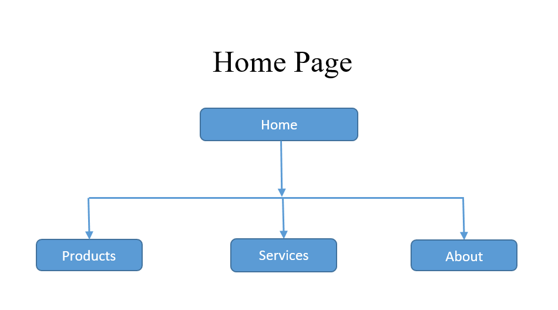
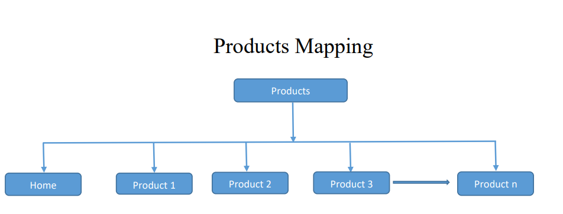
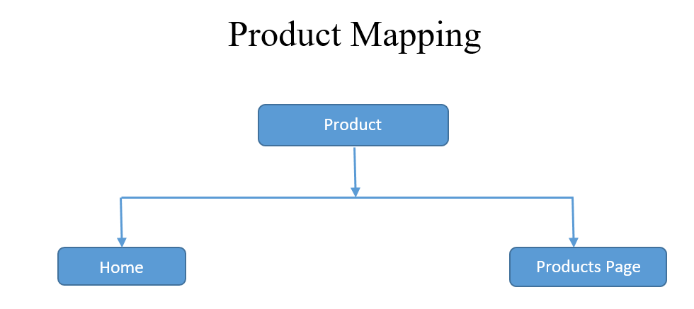
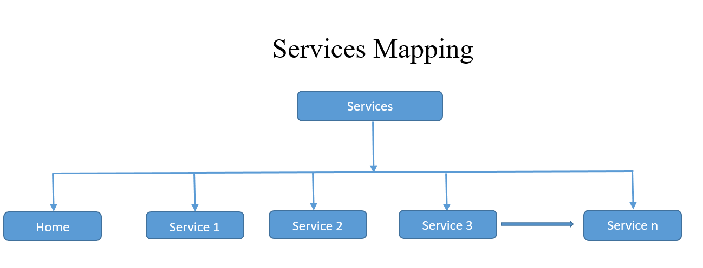
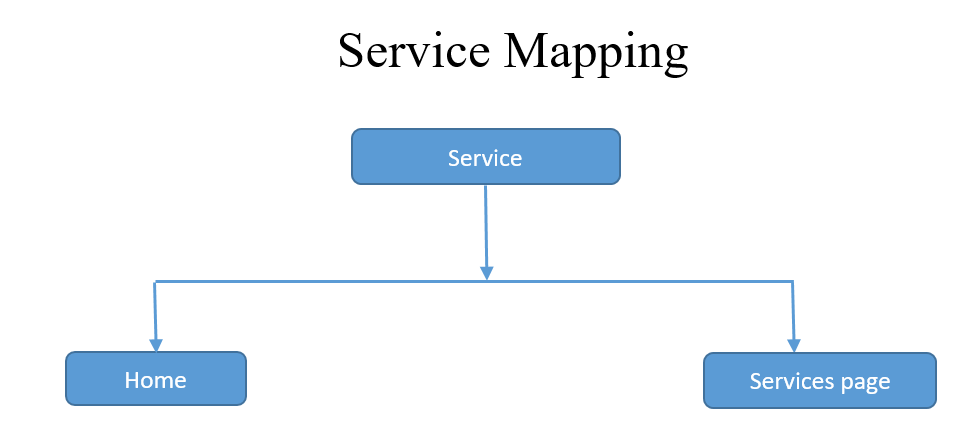
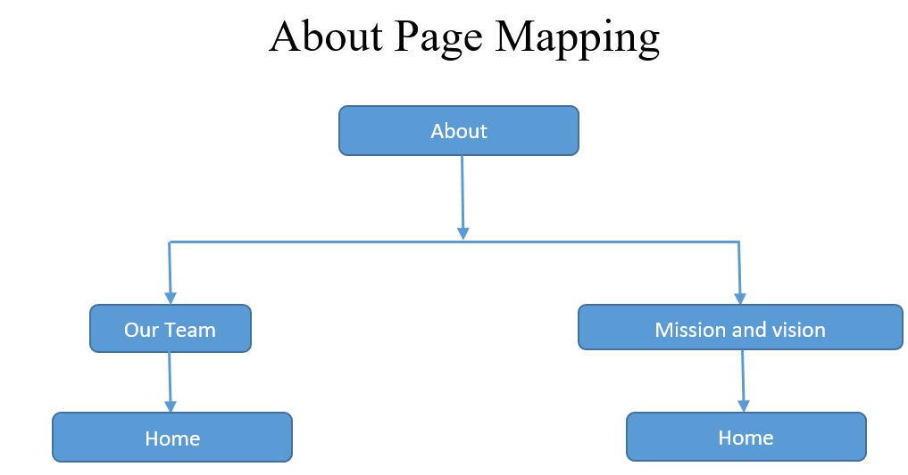

**7. Website Mapping**
=======================

**7.1 Introduction To Website Mapping**
----------------------------------------
Website mapping, also known as site mapping or site navigation, is a crucial step in the web development process. It involves creating a visual representation of the structure and organization of a website. The goal of website mapping is to plan and define the layout, content hierarchy, and user flow of a website before it is built. This helps ensure a clear and intuitive user experience.

Here are the key components and steps involved in website mapping:

**1. Define Objectives and Goals**:

- **Purpose of the Website**: Determine the main goal or purpose of the website. Is it to provide information, sell products, offer services, or something else?

- **Target Audience**:
  Identify the intended users of the website and their specific needs and preferences.

- **Conversion Goals**: 
  Define what actions you want users to take on the website (e.g., making a purchase, filling out a contact form, signing up for a newsletter).

**2. Identify Main Pages**:

- Start by listing the main pages or sections that will make up the website. These are typically found in the main navigation menu.

- Common main pages include Home, About Us, Services, Products, Blog, Contact, etc.

**3. Create Subpages and Categories**:

- If applicable, break down main sections into subpages or categories. For example, under "Products," you might have categories like "Men's Clothing" and "Women's Clothing."

**4. Establish Page Relationships**:

- Determine how pages are connected and how users can navigate between them. This includes setting up main menu links, footer links, and internal links within content.

**5. Wireframing**:

- Create wireframes for each page to outline the layout, placement of elements, and overall design. Wireframes are basic sketches or mock-ups of a page's visual structure.

**6. Content Planning**:

- Decide on the type of content that will be included on each page. This could be text, images, videos, forms, and any interactive elements.

- Consider how the content will be organized and presented to provide a seamless user experience.

**7. User Flow and Interaction**:

- Define the user journey and interactions. This includes paths users will take to navigate through the website, complete tasks, and achieve their goals.

**8. Accessibility and SEO Considerations**:

- Ensure that the website is designed with accessibility in mind, making it usable for people with disabilities.

- Plan for SEO (Search Engine Optimization) by identifying relevant keywords and structuring content to improve search engine rankings.

**9. Mobile Responsiveness**:

- Ensure that the website design is responsive and accessible on various devices, including desktops, tablets, and mobile phones.

**10.Testing and Feedback**:

- Once the website map is complete, it's important to review and test the structure to ensure it meets the objectives and provides a seamless user experience.

**7.2 Home Page Mapping**
--------------------------

- If a user visits the website's Home page, they will likely encounter an introductory page that provides an overview of the website's content, purpose, and options to navigate to other sections.

- If a user selects Products, they will be taken to a page or section dedicated to showcasing various products offered by the company or organization.

- Similarly, selecting Services would lead the user to a section outlining the services provided by the company.

- Clicking on About would take the user to a page with information about the company, such as its history, mission, and the team behind it.

**7.3 Products Mapping**
-------------------------

**7.4 Product Mapping**
------------------------

**7.5 Services Mapping**
--------------------------

**7.6 Service Mapping**
-----------------------

    
    
**7.7 About Page Mapping**
---------------------------

