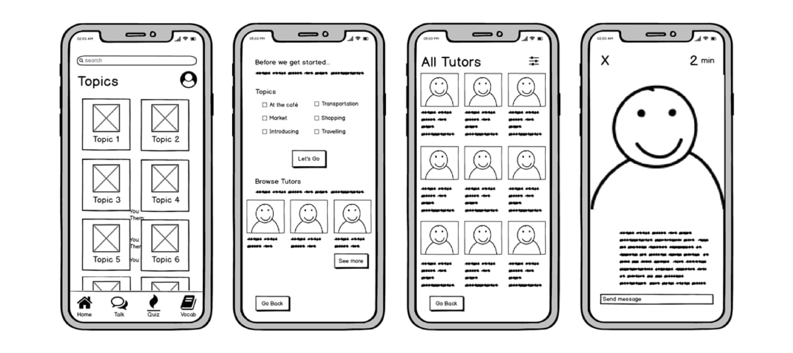

**2.What is a wireframe**
==========================
wireframe is a two-dimensional skeletal outline of a webpage or app. Wireframes provide a clear overview of the page structure, layout, information architecture, user flow, functionality, and intended behaviors. As a wireframe usually represents the initial product concept, styling, color, and graphics are kept to a minimum.

Wireframes can be drawn by hand or created digitally, depending on how much detail is required.

Wireframing is a practice most commonly used by UX designers. This process allows all stakeholders to agree on where the information will be placed before the developers build the interface out with code.

**2.1 types of wireframes**
----------------------------

1) Low-fidelity wireframes
2) Mid-fidelity wireframes
3) High-fidelity wireframes

**2.1.1 Low-fidelity wireframes**
^^^^^^^^^^^^^^^^^^^^^^^^^^^^^^^^^
Low-fidelity wireframes are basic visual representations of the webpage and usually serve as the design's starting point. As such, they tend to be fairly rough, created without any sense of scale, grid, or pixel-accuracy.

Low-fidelity wireframes omit any detail that could potentially be a distraction and include only simplistic images, block shapes, and mock content—such as filler text for labels and headings.

**2.1.2 Mid-fidelity wireframes**
^^^^^^^^^^^^^^^^^^^^^^^^^^^^^^^^^

The most commonly used wireframe of the three, mid-fidelity wireframes feature more accurate representations of the layout. While they still avoid distractions such as images or typography, more detail is assigned to specific components, and features are clearly differentiated from each other.

Varying text weights might also be used to separate headings and body content. Though still black and white, designers can use different shades of grey to communicate the visual prominence of individual elements. Although they are still relevant in a product's early stages, mid-fidelity wireframes are usually created using a digital wireframing tool, such as Sketch or Balsamiq.

**2.1.3 High-fidelity wireframes**
^^^^^^^^^^^^^^^^^^^^^^^^^^^^^^^^^^^

Finally, high-fidelity wireframes boast pixel-specific layouts. Where a low-fidelity wireframe may include pseudo-Latin text fillers and grey boxes filled in with an ‘X’ to indicate an image, high-fidelity wireframes may include actual featured images and relevant written content.

This added detail makes high-fidelity wireframes ideal for exploring and documenting complex concepts such as menu systems or interactive maps.

High-fidelity wireframes should be saved for the latter stages of the product's design cycle.

**2.2 Figma (WireFrame Tool)**
-------------------------------

**2.2.1 Introduction**
^^^^^^^^^^^^^^^^^^^^^^^
Figma is a web-based collaborative design tool that enables teams to create, edit, and share user interfaces and prototypes in real-time. It offers a powerful set of features for designing, prototyping, and collaborating on projects.

**2.2.2 Getting Started**
^^^^^^^^^^^^^^^^^^^^^^^^^

**1) Creating an Account**
To get started with Figma, visit https://www.figma.com/ and sign up for a new account. You can choose between a free plan and paid plans with additional features. 

**2) Dashboard Overview**
After logging in, you will be taken to the Figma dashboard. This is where you can create new projects, access existing ones, and manage your team settings.

**2.2.3 Creating and Editing Designs**
^^^^^^^^^^^^^^^^^^^^^^^^^^^^^^^^^^^^^^

**1)Canvas**:
The canvas is where you create and arrange your designs. It's a blank space where you can add frames, shapes, text, and images.

**2)Layers**:
Layers panel allows you to organize and manage the elements on your canvas. You can rearrange, group, and rename layers for better organization.

**3)Tools** 
Figma provides a range of tools for creating and editing designs, including selection, drawing, text, and more. Familiarize yourself with these tools to efficiently create your designs.

**2.2.4 Collaboration**
^^^^^^^^^^^^^^^^^^^^^^^^

**1)Inviting Team Members**:
You can invite team members to collaborate on your projects. Simply click on the project, select "Invite to project" and enter their email addresses.

**2)Real-time Collaboration**
Figma excels in real-time collaboration. Multiple team members can work on the same design simultaneously, making it easy to give feedback and make changes in real-time.

**2.2.5 Prototyping**
^^^^^^^^^^^^^^^^^^^^^^

**1)Creating Prototypes**
Figma allows you to create interactive prototypes by linking frames together. This enables users to navigate through your design and experience the flow.

**2)Linking Screens**
You can create links between frames to simulate user interactions. This is crucial for creating interactive prototypes that demonstrate the user flow.

**3)Interactive Elements**
Add interactive elements like buttons and hotspots to your frames. These elements can be linked to other frames to create a seamless interactive experience.

**2.2.5 Design Systems**
^^^^^^^^^^^^^^^^^^^^^^^^^

**1) Creating Components**
Figma supports design systems by allowing you to create and reuse components. This ensures consistency across your designs and saves time.

**2) Using Design Libraries**
You can use design libraries to store and manage design assets, making it easy to maintain consistency across multiple projects.

**2.2.6 Version History**
^^^^^^^^^^^^^^^^^^^^^^^^^^^

Figma keeps track of version history, allowing you to revert to previous versions of your designs. This feature is invaluable for tracking changes and collaborating effectively.

**2.2.7 Plugins and Integrations**
^^^^^^^^^^^^^^^^^^^^^^^^^^^^^^^^^^^^

Figma supports a wide range of plugins and integrations that extend its functionality. Explore the Figma community to discover plugins that can enhance your workflow.

**2.2.8 Exporting Assets**
^^^^^^^^^^^^^^^^^^^^^^^^^^^

You can export assets from Figma in various formats, making it easy to hand off designs to developers or share them with stakeholders.

**2.2.9 Figma Designed Website**
^^^^^^^^^^^^^^^^^^^^^^^^^^^^^^^^^

.. image :: ../images/figmaDesign.png

`View Figma Design <https://www.figma.com/file/CkHX1Cdr32ullecWYC3j5E/Untitled?type=design&node-id=0-1&mode=design&t=lk46ODCWxn2F0kYb-0>`_

**2.3 Pencil Project (WireFrame Tool)**
----------------------------------------
The Pencil Project is an open-source GUI prototyping tool that allows users to create wireframes and mockups for websites, mobile applications, and other digital interfaces. It is a free and easy-to-use tool that helps designers and developers visualize the layout and functionality of a project before the actual coding and design work begins

**1. User Interface Elements**:
Pencil provides a wide range of pre-built user interface elements (UI elements) like buttons, forms, icons, and other design components. These elements can be easily dragged and dropped onto the canvas to create the wireframe.

**2. Diverse Stencil Collections**:
The Pencil Project offers various stencil collections which are sets of pre-designed UI elements specific to different platforms and design styles. This includes stencils for platforms like Android, iOS, Windows, and generic web design elements.

**3 .Customizable Stencils**:
Users can customize existing stencils or create their own to fit specific design needs. This allows for a high level of flexibility in designing wireframes.

**4. Linking and Interactivity**:
Pencil allows designers to create interactive wireframes by linking elements together. This enables the simulation of user flows and basic navigation within the wireframe.

**5. Export Options**:
Designs created in Pencil can be exported in various formats including PNG, PDF, and HTML. This makes it easy to share the wireframes with stakeholders, developers, or other team members.

**6. Open-Source and Cross-Platform**:
Being open-source, the Pencil Project is free to use, and its codebase is available for modification and improvement by the community. It's also compatible with different operating systems, including Windows, macOS, and Linux.